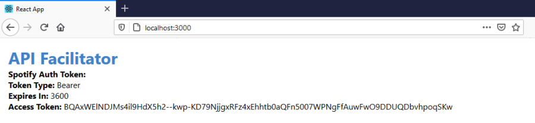

## An Application Programming Interface (API) Facilitator

This is the API Facilitator component, which simplifies the consumption of available
or fully public third-party APIs.

### **Spotify API**
The Sotify API facilitation is currently implemented, so importing functions related
to Spotify API calls will work. Refer to the print screen below:

