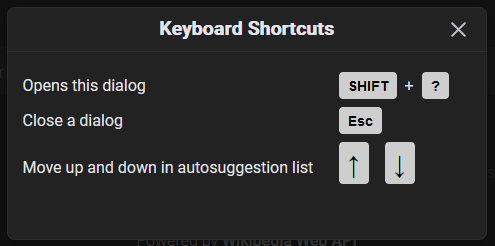
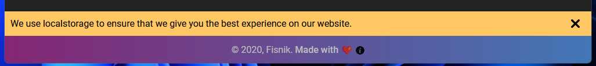
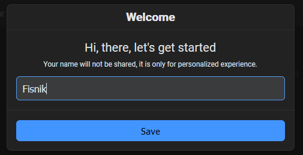
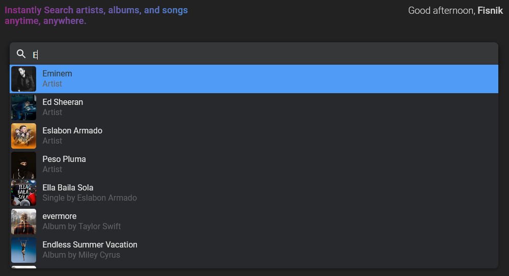
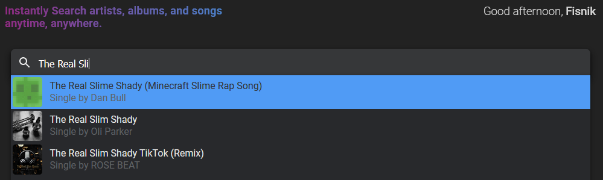
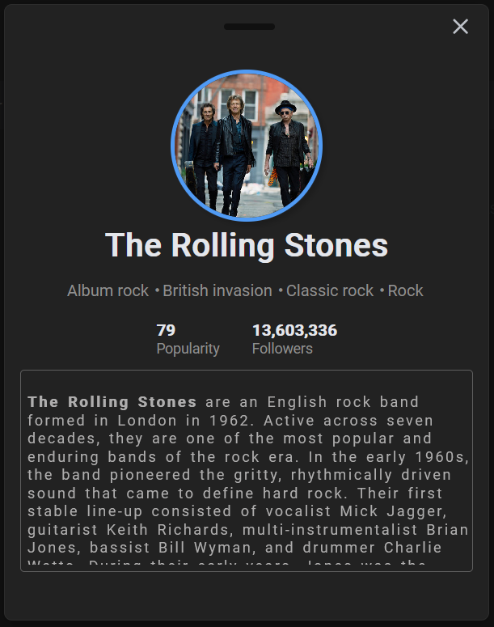
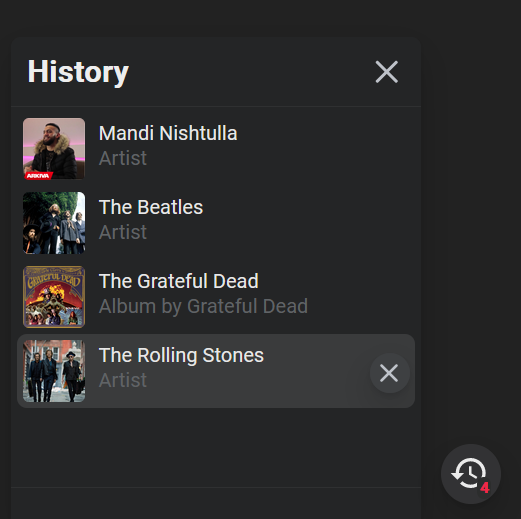

# Music Search Utility

## Motivation
This project represents a web application that is powered by Reactjs under Nodejs and is designed to be modern and good looking. The core motivation behind this project was to get more familiar with Reactjs. As two people working on this project with time constraints and the requirements to produce a deliverable that runs and serves a purpose (think: a somewhat useful React-powered application) we opted in for something we thought at the point of creating this, would look cool and handy.

After brainstorming over Zoom for a whole day, we settled with the idea of developing an app that would use the HTML5 Audio API to play music—essentially a React music player. But, after iterating a couple of times and with the massive features (“Feature bloat”) we wanted to add we quickly realized that we would run late and end up never finishing the project. Therefore, we decided to make something a bit simpler, but that would still try to remain cool, interesting, relevant, and to some extent useful for music enthusiasts. So, a quick pivot it was. 

We settled for a search app, that would allow the visitor to freely search for their favorite artist, group, album, or single. The React-based application would provide the user with interesting information, including lyrics of their favorite songs. 

The React-based application utilizes a small number of public third-party web APIs for querying this information. Please see below [3rd party web APIs used](###listing-apis-used-in-this-stack). The project was developed in such a way that pieces of code would be abstracted away, and everything is component based with proper imports. Each separate component has its functions and purpose. 

You can freely clone this down to your machine and run it, please refer to the [Install instructions](#installing).  


## The Application
This utility is a simple website, with a dark theme, we decided to go with dark because it looks good. It has a search input, a separate component which greets the user depending on time of the day and the given name, and a special feature which is the history feature.

P.s.s. Some hints:

* Press **SHIFT + ?** - this will open up a dialog with shortcut-keys
* In an active dialog, press **ESC** to close.



## Technical Decisions
React was chosen as the core framework of this project due to the simplicity, clean, and single-page nature of this web application. One of React’s core strengths lies in building web applications with pages that act independently from each other, for example, a component displaying time can do this in its own state without being affected by changes in another component on the same page. [^1] 

Now we will dive into some comparisons and reasons behind decisions we made, follow along. 
The first reason we decided React over Angular, is because we liked how easy it is to quickly get started and code, there is a huge community and React is also a lot more popular compared to Angular [^2]. On a technical note [^3]: “one of the powerful sides of React is that it provides a good abstraction which means that it does not expose any complex internals to the user.”  In addition, since none of us had good previous experience with TypeScript we felt it would require extra time to pick up and fully learn. Furthermore, Angular has a steep learning curve and is not well-documented [^4].

When it came to Vue.js, we knew that both Vue.js and Reactjs are two of the biggest and most popular front-end frameworks out there. However, they both as always come with differences. Virtual DOM is something both frameworks implement, which allows you to refresh parts of the page, or single components without reloading the whole page [^5]. Component-based development which allows code reuse and improves productivity, and speed is provided by both [^5]. Syntax differs a bit. But, Reactjs at the time of decision had and still probably has more widespread usage.

The last reason we decided to go with React is because of light previous experience with this framework, we decided to explore it deeper and build something cool. 

For the CSS framework, we skipped the public options and decided to handcraft our own CSS-like framework. The decision to proceed with this was because we (1) wanted more control over our user interface and (2) wanted to do something better than what exists out there. 

For third-party web APIs, we decided to pick a few that suited our web application purpose. Since we decided in a very short time to pivot and build a utility for searching artists, albums, songs, and tracks, we knew what APIs we needed to choose. 

### Listing APIs used in this stack: 

* Spotify Web API (Core driver)
* Napster Web API
* Wikipedia Web API (for additional details about artists e.g. bio summary)
* ~~APISEEDS Lyrics API~~ (**Deprecated**).

## **Not production ready!**
> **Warning**: This code was developed under an older version of **Node**, and most of the `npm packages` in the `package.json` are outdated. Upgrading, as has been attempted resulted in too many errors and just became too much of a hussle. Therefore, it is highly recommended that you use this for learning purpose only. 

> :lock: **Security**: The *Dependabot* does report over 30 security vulnerabilities, but, at this point it is ignored. The authors of this project and repository cannot be held accountable if you, or your organization, or team decide to use this in production code. If you use this in production, you are solely responsible for the outcome. You have hereby been informed. 

## Installation
> **Warning**: Runs only with older version of node. Supported: `Node v14.3.0`. 

1. Make sure you have [node.js](https://nodejs.org/en/) and 
[npm](https://www.npmjs.com/get-npm) installed on your machine.
2. `$ git clone https://github.com/defunxyz/music-search.git`
3. `$ cd music-search`
4. `$ npm install`
5. `$ npm start`
6. Now run on [localhost:3000](http://localhost:3000)

> **Note**: Please make an `.env` file in the root folder with the content below:

```
REACT_APP_NAPSTER_API_KEY=
REACT_APP_NAPSTER_API_KEY_SECRET=

REACT_APP_SPOTIFY_CLIENT_ID=
REACT_APP_SPOTIFY_CLIENT_SECRET=

REACT_APP_APISEED_API_KEY=
```

> **Note**: If everything goes well, you should see the output shown below:

```
Compiled successfully!

You can now view musicapp in the browser.

  Local:            http://localhost:3000
  On Your Network:  http://192.168.64.1:3000

Note that the development build is not optimized.
To create a production build, use npm run build.
```

## Running examples

### **1.** First time a message of how information is stored is presented to the visitor


### **2.** First time asking for visitor's name


### **3.** Instant auto-suggest search


#### **3.1.** Search for a single by its name


### **4.** View artist profile card


### **5.** Easily access searched history


## Addendum
Due to very tough time constraints, there might be some strange behaviour in this utility. However, eventually, in the near feature, unless occupied by some other more important project, we might find time and come back and finish this *perfectly*. 

[^1]:  ["Why and Where Should you Use React for Web Development?"](https://www.simform.com/blog/why-use-react/). 
[^2]:  ["Front-end frameworks popularity (React, Vue, Angular and Svelte) "](https://gist.github.com/tkrotoff/b1caa4c3a185629299ec234d2314e190). 
[^3]:  ["7 Reasons why you should use React"](https://stories.jotform.com/7-reasons-why-you-should-use-react-ad420c634247). 
[^4]:  ["React vs Angular: Which Is A Better JavaScript Framework?"](https://technostacks.com/blog/react-vs-angular/). 
[^5]:  ["Vue vs React in 2022 - Comparison of Two Most Popular JS Frameworks"](https://www.monterail.com/blog/vue-vs-react-2020). 

## License
This project is licensed under the [BSD-2-Clause license](LICENSE).
